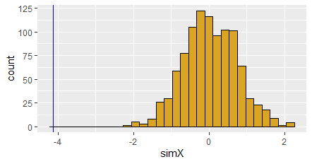

```{r setup, include=FALSE}
knitr::opts_chunk$set(echo = TRUE)
```

# **Problem 1**

*Using a for loop, write a function to calculate the number of zeroes in a numeric vector. Before entering the loop, set up a counter variable `counter <- 0`. Inside the loop, add 1 to counter each time you have a zero in the matrix. Finally, use `return(counter)` for the output.*

The function:
```
#-----------------------------------------
# FUNCTION ZeroCounter
# description: Counting the number of zeros in an input vector with a for-loop
# inputs: a vector (matrix)
# outputs: number of zeros in the vector
##############################
ZeroCounter <- function(vec=NULL) {
  if(is.null(vec)){
    vec <- c(rep(0,3),rep(1,3),rep(2,3))
  }
  
  counter <- 0
  
  for(e in vec){
    if (e==0){
      counter = counter + 1
    }
  }
  
  return(counter)
}# end of ZeroCounter
#-----------------------------------------
```
Calling the function:
```
print(ZeroCounter())
print(ZeroCounter(c(5:10)))
print(ZeroCounter(c(1,2,0,4,3,3,0)))
```
resulting in
```
[1] 3
[1] 0
[1] 2
```

# **Problem 2**
*Use subsetting instead of a loop to rewrite the function as a single line of code.*
The single-line function:
```
#-----------------------------------------
# FUNCTION SingleLine_ZeroCounter
# description: Counting the number of zeros in an input vector with subsetting
# inputs: a vector (matrix)
# outputs: number of zeros in the vector
##############################
SingleLine_ZeroCounter <- function(vec=NULL) {
  
  if(is.null(vec)){
    vec <- c(rep(0,3),rep(1,3),rep(2,3))
  }
  
  zcount <- length(vec[vec==0])
  
  return(zcount)
  
}# end of SingleLine_ZeroCounter
#-----------------------------------------
```
This function results similarly to the function written for Problem 1.


# **Problem 3**
*Write a function that takes as input two integers representing the number of rows and columns in a matrix. The output is a matrix of these dimensions in which each element is the product of the row number x the column number.*
The function:
```
#-----------------------------------------
# FUNCTION FormMatrix
# description: Creating a matrix with a specified shape, in which the value at element (i,j) is ixj
# inputs: number of columns and rows
# outputs: creating a matrix with element (i,j) having values ixj
##############################
FormMatrix <- function(nrow=3,ncol=3) {
  
  M <- matrix(nrow=nrow, ncol=ncol)
  for (i in 1:nrow){
    for (j in 1:ncol){
      M[i,j] = i*j
    }
  }
  
  return(M)
}# end of FormMatrix
#-----------------------------------------
```
Calling the function:
```
FormMatrix()
```
resulting in 
```
     [,1] [,2] [,3]
[1,]    1    2    3
[2,]    2    4    6
[3,]    3    6    9
```
And calling
```
FormMatrix(2,5)
```
results
```
    [,1] [,2] [,3] [,4] [,5]
[1,]    1    2    3    4    5
[2,]    2    4    6    8   10
```

# **Problem 4**
*Use the code from the April 8th lecture (Randomization Tests) to design and conduct a randomization test for some of your own data. You will need to modify the functions that read in the data, calculate the metric, and randomize the data. Once those are set up, the program should run correctly calling your new functions. Also, to make your analysis fully repeatable, make sure you set the random number seed at the beginning (use either `set.seed()` in base R, or `char2seed` in the TeachingDemos package*

Here, I used a data similar to the vernalization variables that I had simulated and used in the previous homework (HW-9). The only difference is that I added a column corresponding to a new variable which is the vernalization duration (number of weeks that a sample plant has undergone the cold weather). I simulated this data and saved it in .csv format to read here.

Building functions:
```

###################################################
# function: readData
# read in (or generate) data set for analysis
# input: file name (or nothing, for this demo)
# output: 3 column data frame of observed data (ID,x,y)
#------------------------------------------------- 
readData <- function(z=NULL) {
  if(is.null(z)){
    xObs <- 1:20
    yObs <- xObs + 10*rnorm(20)
    dF <- data.frame(ID=seq_along(xObs),xObs,yObs)} # set up data frame   
  dF <-read.table(file=z,
                  header=TRUE,
                  sep=",",
                  stringsAsFactors=FALSE)  
  return(dF)
}# end of readData
#-----------------------------------------

##################################################
# function: getMetric
# calculate metric for randomization test
# input: 2-column data frame for regression
# output: regression slope
#------------------------------------------------- 
getMetric <- function(z=NULL) {
  if(is.null(z)){
    xObs <- 1:20
    yObs <-  xObs + 10*rnorm(20)
    z <- data.frame(ID=seq_along(xObs),xObs,yObs)} # set up data frame                 
  
  . <- lm(z[,3]~z[,2])
  . <- summary(.)
  . <- .$coefficients[2,1]
  
  slope <- .
  
  return(slope)
}# end of getMetric
#-----------------------------------------

##################################################
# function: shuffleData
# randomize data for regression analysis
# input: 3-column data frame (ID,xVar,yVar)
# output: 3-column data frame (ID,xVar,yVar)
#------------------------------------------------- 
shuffleData <- function(z=NULL) {
  if(is.null(z)){
    xObs <- 1:20
    yObs <- xObs + 3*rnorm(20)
    z <- data.frame(ID=seq_along(xObs),xObs,yObs)} # set up data frame                 
  z[,3] <- sample(z[,3]) # use sample function with defaults to reshuffle column
  
  return(z)
}# end of shuffleData
#-----------------------------------------


##################################################
# function: getPVal
# calculate p value from simulation
# input: list of observed metric, and vector of simulated metrics
# output: lower, upper tail probability values
#------------------------------------------------- 
getPVal <- function(z=NULL) {
  if(is.null(z)){
    z <- list(xObs=runif(1),xSim=runif(1000))}
  pLower <- mean(z[[2]]<=z[[1]])
  pUpper <- mean(z[[2]]>=z[[1]])
  return(c(pL=pLower,pU=pUpper))
}# end of getPVal
#-----------------------------------------


##################################################
# function: plotRanTest
# create ggplot of histogram of simulated values
# input: list of observed metric and vector of simulated metrics
# output: saved ggplot graph
#------------------------------------------------- 
plotRanTest <- function(z=NULL) {
  if(is.null(z)){
    z <- list(rnorm(1),rnorm(1000)) }
  dF <- data.frame(ID=seq_along(z[[2]]),simX=z[[2]])
  p1 <- ggplot(data=dF,mapping=aes(x=simX))
  p1 + geom_histogram(mapping=aes(fill=I("goldenrod"),color=I("black"))) +
    geom_vline(aes(xintercept=z[[1]],col="blue")) 
  
}
```
Using the written function to do the work and recalculate the metric over the randomized data:
```
dF <- readData("VernData.csv")
print(df)
```
the data looks like the following
```
   ID VernDuration TimeToFlower
1   1            0     73.60924
2   2            0     59.51158
3   3            0     67.22685
4   4            0     57.31535
5   5            0     70.23224
6   6            0     78.37059
7   7            0     66.37863
8   8            0     67.64158
9   9            0     63.48439
10 10            0     74.36976
11 11            2     55.26434
12 12            2     37.76474
13 13            2     29.35592
14 14            2     48.96856
15 15            2     47.11013
16 16            2     52.70338
17 17            2     59.29663
18 18            2     40.66842
19 19            2     57.97205
20 20            2     42.65050
21 21            4     39.59569
22 22            4     26.23754
23 23            4     46.09309
24 24            4     37.00454
25 25            4     38.24409
26 26            4     47.98675
27 27            4     35.71995
28 28            4     44.62640
29 29            4     38.48327
30 30            4     36.46827
31 31            6     43.41147
32 32            6     35.51211
33 33            6     34.76636
34 34            6     40.26141
35 35            6     32.01643
36 36            6     32.59238
37 37            6     28.99594
38 38            6     32.28827
39 39            6     31.21205
40 40            6     34.38130
41 41            8     30.02561
42 42            8     32.88250
43 43            8     35.15080
44 44            8     33.45357
45 45            8     30.47847
46 46            8     35.54720
47 47            8     31.90577
48 48            8     31.73923
49 49            8     31.46473
50 50            8     35.56799
```

```
Xobs <- getMetric(dF)

set.seed(1)

nSim <- 1000
Xsim <- rep(NA,nSim) # vector of simulated ANOVA p-values

for (i in seq_len(nSim)) {
Xsim[i] <- getMetric(shuffleData(dF))
}

slopes <- list(Xobs,Xsim)
getPVal(slopes)

##  pL pU 
##   0  1 

plotRanTest(slopes)
```


# **Problem 5**
*For comparison, calculate in R the standard statistical analysis you would use with these data. How does the p-value compare for the standard test versus the p value you estimated from your randomization test? If the p values seem very different, run the program again with a different starting seed (and/or increase the number of replications in your randomization test). If there are persistent differences in the p value of the standard test versus your randomization, what do you think is responsible for this difference?*

Calculating the p-value from the standard statistical ansysis:
```
reg <- lm(dF$TimeToFlower~dF$VernDuration)
summary(reg)$coefficients[2,4]
```
which results in p-value of `1.089158e-13`. This is pretty low (very statistically significant) and it matches the p-value that we got through our randomization test.
