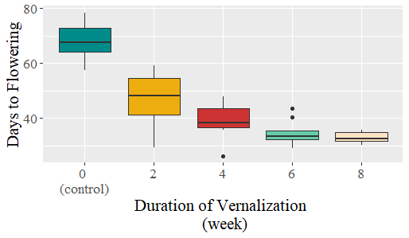
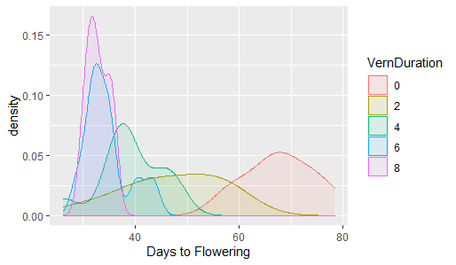

```{r setup, include=FALSE}
knitr::opts_chunk$set(echo = TRUE)
```

*For this exerise, use your newly-developed ggplot chops to create some nice graphs from your own data (If you do not have a good data frame to use for graphics, use one of the many built-in data frames from R (other than mpg, which we are using in class)). Experiment with different themes, theme base sizes, aesthetics, mappings, and faceting. When you are finished, try exporting them to high quality pdfs, jpgs, eps files, or other formats that you would use for submission to a journal.*

For this homework, I visualized the same data that I have used for [Homework 10](week10.html), i.e., the weekly vernalization data.

```
library(ggplot2)

df <-read.table(file="VernData.csv",
                header=TRUE,
                sep=",",
                stringsAsFactors=FALSE)

df$VernDuration <- as.factor(df$VernDuration)
```
### Creating Boxplots
In creating the boxplot,  

```
cols <- c("darkcyan", "darkgoldenrod2", "brown3", "aquamarine3", "bisque1")

g <- ggplot(data=df,
            mapping=aes(x=VernDuration, y=TimeToFlower, fill=VernDuration))+
  geom_boxplot()

gp <- g + scale_x_discrete(labels=c("0 \n(control)","2","4","6","8")) +
  scale_fill_manual(values=cols) + 
  labs(y = "Days to Flowering", x = "Duration of Vernalization \n (week)") +
  theme(legend.position = "none",
        text = element_text(size = 16, family = "serif"))

print(gp)
```


### Density of the Sample Points
```
g <- ggplot(data=df, aes(x=TimeToFlower)) +  geom_density(alpha = 0.1, aes(fill=VernDuration, colour=VernDuration)) + labs(x="Days to Flowering")

print(g)

```
