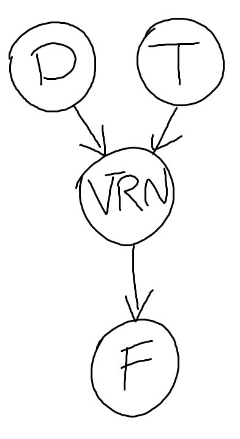
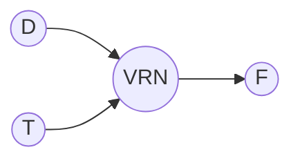

```{r setup, include=FALSE}
knitr::opts_chunk$set(echo = TRUE)
```


# **Headers**

# Computional Biology 
## Computional Biology
### Computional Biology
#### Computional Biology
##### Computional Biology
###### Comutional Biology

# **Unordered lists**

* Monocotyledon  
* Dicotyledons 
    + *Arabidopsis* 
    + *Papaver* 
    
    
# **Manual line breaks**   
Sky is blue,   
Violets are blue, too.
   

# **Links**   
[My webpage](home.html)

# **Images**   


# **Block quotes**   

> I would rather be an artist than a leader. 

# **Plain code blocks**   

```
Practice makes perfect.
```
# **R code block**   
```

> qplot(x= mass, y= time)
```
# **In line blocks**   

Keep up the good work with your `Computional Biology tools`


# **Centered LaTeX equation**   

These equations such  as $a= 3+ 4$ will appear inside of a single line of text. 

These equations such  $$ a= 3+ 4  $$ will appear in separate line of their own.


# **Horizontal line**   
___


# **Simple table**   

Mass (g)      | Time (min)
------------- | -------------
125           | 23 
130           | 45

# **Text highlighting**   

A man who dares to waste one hour of time has not discovered the value of life <span style="background-color: #FFFF00"></span>. <span style="background-color: #FFFF00">'Darwin'</span>

# **Cause-and-effect diagram** 

The hand-drawn flowchart:





    
#### **Miscellaneous**   

In line execution of r inside the backticks by inserting r as the first element `r 3 +pi`


```
everything here is in a plaintext.
even single line.
usfel especially when showing other coding instructions.
```

####  **Subscripts**

$$H_0=Z_{a+b}$$


####  **Superscripts**

$$s= cA^z$$

Elements can be coupled and nested.
$$ s=cA^z_1+z_2{2+ x}$$

####  **Fractions and Greek symbols**

$$\alpha= \frac{\beta}{\delta+\gamma_x}$$


####  **Summation signs**
$$z=\sum_{i=1}^x{k}$$

####   **Escape the backslash with a custome term**


$$\backslash \alpha \le b \backslash$$

####   **Rendering plaintext in a LaTex equatin**

$$P(Occuurence of Species A)= Z$$

$$P(\mbox{Occurrence of Species A})=z$$


[Return to Main Page](index.html)