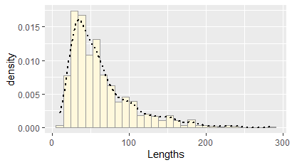
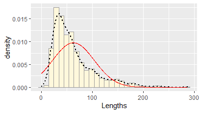
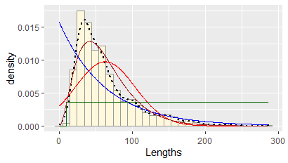
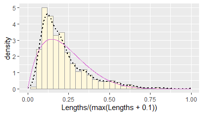
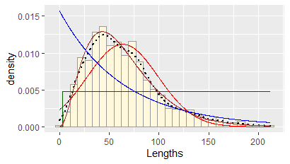
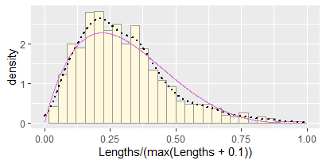

```{r setup, include=FALSE}
knitr::opts_chunk$set(echo = TRUE)
```

# **My Own Data** 
For the first part of this homework, a publicly available data set was downloaded from Dryad related to paper "Burns, Michael (2020), Adaptation to herbivory and detritivory drives the convergent evolution of large abdominal cavities in a diverse freshwater fish radiation (Otophysi: Characiformes)".

```
library(ggplot2) # for graphics
library(MASS) # for maximum likelihood estimation

z <- read.table("Lengths.csv",header=TRUE,sep=",", stringsAsFactors=FALSE)
str(z)
summary(z$Lengths)
```

 Here is the output to `str` and `summary`:
 
 ```
> str(z)
'data.frame':	978 obs. of  1 variable:
 $ Lengths: num  36.2 37.5 40.5 48.5 50 ...
 > summary(z)
    Lengths      
 Min.   : 10.00  
 1st Qu.: 33.67  
 Median : 51.64  
 Mean   : 63.12  
 3rd Qu.: 78.67  
 Max.   :286.35  
 ```

 Plotting the histogram and the density curve:
 
 ```
 p1 <- ggplot(data=z, aes(x=Lengths, y=..density..)) +
  geom_histogram(color="grey60",fill="cornsilk",size=0.2) 
print(p1)

p1 <-  p1 +  geom_density(linetype="dotted",size=0.75)
print(p1)
```


```
normPars <- fitdistr(z$Lengths,"normal")
print(normPars)
str(normPars)
normPars$estimate["mean"] # note structure of getting a named attribute
```
The estimated mean is `63.1168098` and the SD is estimated as `40.8578215`. Now, we use these estimated parameters to plot the probability distribution:
```
# estimated mean and SD
meanML <- normPars$estimate["mean"]
sdML <- normPars$estimate["sd"]

# drawing normal probability distributions based on the estimated parameters
xval <- seq(0,max(z$Lengths),len=length(z$Lengths))

stat <- stat_function(aes(x = xval, y = ..y..), fun = dnorm, colour="red", n = length(z$Lengths), args = list(mean = meanML, sd = sdML))
p1 + stat
```


Plotting other probability distributions:

```
# plotting exponential distribution
expoPars <- fitdistr(z$Lengths,"exponential")
rateML <- expoPars$estimate["rate"]

stat2 <- stat_function(aes(x = xval, y = ..y..), fun = dexp, colour="blue", n = length(z$Lengths), args = list(rate=rateML))
 p1 + stat + stat2
 
# plotting uniform distribution 
# the parameters here are the minimum and maximum values of the data
stat3 <- stat_function(aes(x = xval, y = ..y..), fun = dunif, colour="darkgreen", n = length(z$Lengths), args = list(min=min(z$Lengths), max=max(z$Lengths)))
 p1 + stat + stat2 + stat3
 
# plotting Gamma distribution
gammaPars <- fitdistr(z$Lengths,"gamma")
shapeML <- gammaPars$estimate["shape"]
rateML <- gammaPars$estimate["rate"]

stat4 <- stat_function(aes(x = xval, y = ..y..), fun = dgamma, colour="brown", n = length(z$Lengths), args = list(shape=shapeML, rate=rateML))
 p1 + stat + stat2 + stat3 + stat4
```


For Beta distribution, the data should be scaled to be between 0 and 1. Therefore, we have to plot this distribution separately:

```
pSpecial <- ggplot(data=z, aes(x=Lengths/(max(Lengths + 0.1)), y=..density..)) +
  geom_histogram(color="grey60",fill="cornsilk",size=0.2) + 
  xlim(c(0,1)) +
  geom_density(size=0.75,linetype="dotted")

betaPars <- fitdistr(x=z$Lengths/max(z$Lengths + 0.1),start=list(shape1=1,shape2=2),"beta")
shape1ML <- betaPars$estimate["shape1"]
shape2ML <- betaPars$estimate["shape2"]

statSpecial <- stat_function(aes(x = xval, y = ..y..), fun = dbeta, colour="orchid", n = length(z$Lengths), args = list(shape1=shape1ML,shape2=shape2ML))
pSpecial + statSpecial
```


# **Simulated Data**
Since Gamma distribution did the best job in fitting our own data as shown above, we simulate a new data from this winning Gamma distribution and then repeat the steps shown above:

```
# sampling the same number of data from Gamma distribution with parameters estimated above
n <- length(z[,1])
simz <- rgamma(n=n,,shape=shapeML, rate=rateML)
simz <- data.frame(1:n,simz)
names(simz) <- list("ID","Lengths")
str(simz)
summary(simz)

p1 <- ggplot(data=z, aes(x=Lengths, y=..density..)) +
 geom_histogram(color="grey60",fill="cornsilk",size=0.2) 
print(p1)

p1 <-  p1 +  geom_density(linetype="dotted",size=0.75)
print(p1)

# fitting and plotting normal distribution
normPars <- fitdistr(simz$Lengths,"normal")
meanML <- normPars$estimate["mean"]
sdML <- normPars$estimate["sd"]
xval <- seq(0,max(simz$Lengths),len=length(simz$Lengths))

stat <- stat_function(aes(x = xval, y = ..y..), fun = dnorm, colour="red", n = length(simz$Lengths), args = list(mean = meanML, sd = sdML))
p1 + stat

# plotting exponential distribution
expoPars <- fitdistr(simz$Lengths,"exponential")
rateML <- expoPars$estimate["rate"]
 
stat2 <- stat_function(aes(x = xval, y = ..y..), fun = dexp, colour="blue", n = length(simz$Lengths), args = list(rate=rateML))
p1 + stat + stat2

# plotting uniform distribution 
# the parameters here are the minimum and maximum values of the data
stat3 <- stat_function(aes(x = xval, y = ..y..), fun = dunif, colour="darkgreen", n = length(simz$Lengths), args = list(min=min(simz$Lengths), max=max(simz$Lengths)))
p1 + stat + stat2 + stat3

# plotting Gamma distribution
gammaPars <- fitdistr(simz$Lengths,"gamma")
shapeML <- gammaPars$estimate["shape"]
rateML <- gammaPars$estimate["rate"]
 
stat4 <- stat_function(aes(x = xval, y = ..y..), fun = dgamma, colour="brown", n = length(simz$Lengths), args = list(shape=shapeML, rate=rateML))
p1 + stat + stat2 + stat3 + stat4
```


```
# plotting Beta distribution separately
pSpecial <- ggplot(data=simz, aes(x=Lengths/(max(Lengths + 0.1)), y=..density..)) +
+     geom_histogram(color="grey60",fill="cornsilk",size=0.2) + 
+     xlim(c(0,1)) +
+     geom_density(size=0.75,linetype="dotted")

betaPars <- fitdistr(x=simz$Lengths/max(simz$Lengths + 0.1),start=list(shape1=1,shape2=2),"beta")
shape1ML <- betaPars$estimate["shape1"]
shape2ML <- betaPars$estimate["shape2"]
 
statSpecial <- stat_function(aes(x = xval, y = ..y..), fun = dbeta, colour="orchid", n = length(simz$Lengths), args = list(shape1=shape1ML,shape2=shape2ML))
pSpecial + statSpecial
```


**How do the two histogram profiles compare? Do you think the model is doing a good job of simulating realistic data that match your original measurements? Why or why not?**

The original and simulated histogram profiles do look similar, except that the latter looks little wider than the former. This might be because the Gamma distribution that we fit to the original data has some errors in terms of the proportions of large data samples. 

[Return to Main Page](index.html)