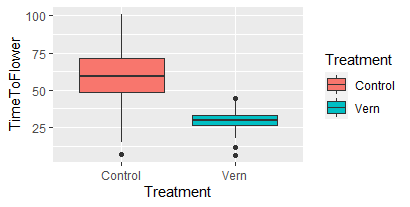
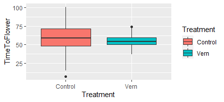

## **Sampling and Organizing the Data**

I use ideas from my PhD project to simulate data for this homework. Our hypothesis simply put is that plants that have gone through a cold weather during several weeks (like in winter) will flower sooner than those that have not experienced the cold. This process is called vernalization which activates several relevant genes to accelerate the flowering process after warm weather finally shows up. We take two groups of plants with and without vernalization and take their floweing time as the random variables:

```
# days to flowering as normal variables
# for each group
# no-vernalization group (control)
noVern <- rnorm(n=100,mean=60,sd=20)
# vernalization group (treatment)
vern <- rnorm(n=100,mean=30,sd=7)

# creating a dataframe from the two group
data <- c(noVern,vern)
treatment <- c(rep("Control", length(noVern)), rep("Vern", length(vern)))
df <- data.frame(1:length(data),treatment,data)
names(df) <- list("ID", "Treatment", "TimeToFlower")
```

## **Analyzing the Data**
Here, we use ANOVA to analyze the simulated data.
```
anova <- aov(TimeToFlower~Treatment, data=df)
print(summary(anova))
```
The `summary` of the ANOVA model results in the following
```
             Df Sum Sq Mean Sq F value Pr(>F)    
Treatment     1  44428   44428   196.2 <2e-16 ***
Residuals   198  44825     226                   
---
Signif. codes:  
0 ‘***’ 0.001 ‘**’ 0.01 ‘*’ 0.05 ‘.’ 0.1 ‘ ’ 1
```

```
# plotting
ANOplot <- ggplot(data=df, aes(x=Treatment, y=TimeToFlower, fill = Treatment)) + geom_boxplot()
print(ANOplot)
```


## **Adjusting the Means**
Given the same sample size, we decreased the difference between the mean of flowering time from the current value to identify the smallest difference ("effect size") that our analysis can detect as a significant difference. For decreasing the difference, I took the mean of the control group fixed and gradually increased the mean of distribution of the treatment group (vernalization group). Keeping the SD of distribution as before, I found out 54 was the largest integer mean that gave a significant pattern.
```
vern <- rnorm(n=100,mean=54,sd=7)
df$TimeToFlower <- c(noVern,vern)

anova <- aov(TimeToFlower~Treatment, data=df)
print(summary(anova))
```
resulting in
```
             Df Sum Sq Mean Sq F value Pr(>F)  
Treatment     1   1000   999.8   4.289 0.0397 *
Residuals   198  46155   233.1                 
---
Signif. codes:
0 ‘***’ 0.001 ‘**’ 0.01 ‘*’ 0.05 ‘.’ 0.1 ‘ ’ 1
```
```
ANOplot <- ggplot(data=df, aes(x=Treatment, y=TimeToFlower, fill = Treatment)) + geom_boxplot()
print(ANOplot)
```


## **Adjusting the Sample Size**
Alternatively, in this part, we reduce the sample size to identify the smallest sample size for which a significant statistical analysis can be obtained. Keeping our original hypothesis as is (the same mean and SD of the distributions), we started reducing the sample size. Sample size of 5 was the smallest for which I could still obtained significant results:
```
n=5
noVern <- rnorm(n=n,mean=60,sd=20)
vern <- rnorm(n=n,mean=30,sd=7)
data <- c(noVern,vern)
treatment <- c(rep("Control", length(noVern)), rep("Vern", length(vern)))
df <- data.frame(1:length(data),treatment,data)
names(df) <- list("ID", "Treatment", "TimeToFlower")
anova <- aov(TimeToFlower~Treatment, data=df)
print(summary(anova))> 
```
resulting in
```
            Df Sum Sq Mean Sq F value Pr(>F)  
Treatment    1   1232    1232   8.612 0.0189 *
Residuals    8   1144     143                 
---
Signif. codes:  0 ‘***’ 0.001 ‘**’ 0.01 ‘*’ 0.05 ‘.’ 0.1 ‘ ’ 1
> 
```

[Return to Main Page](index.html)